

  

    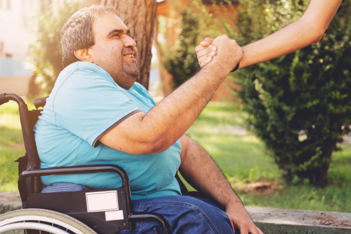
  

  

    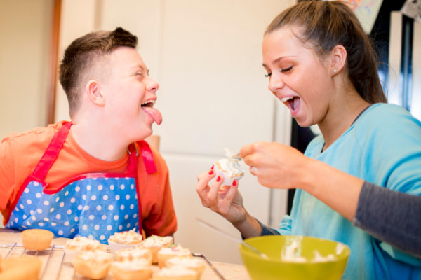
  

  

    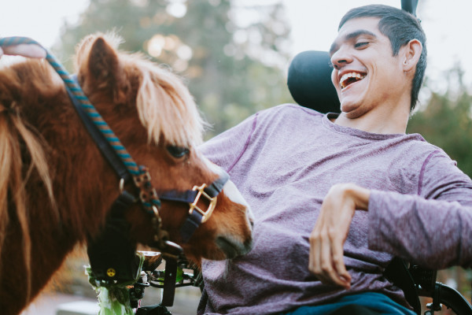
  

**Wir bereiten Menschen mit Behinderung mehr Lebens- und Wohnqualität. Diese Menschen werden in einer Wohneinrichtung der Josefsheim gGmbH in Soest leben.**

  

    

      <a class="button is-primary" href="#wer-sind-wir">Wer sind wir?</a>
    

    

      <a class="button is-primary" href="#was-machen-wir">Was machen wir?</a>
    

    

      <a class="button is-primary" href="#was-treibt-uns-an">Was treibt uns an?</a>
    

  

  

    

      <a class="button is-primary" href="#welche-ziele-verfolgen-wir">Welche Ziele verfolgen wir?</a>
    

    

      <a class="button is-primary" href="#wollen-sie-mitmachen">Wollen Sie mitmachen?</a>
    

    

      <a class="button is-primary" href="#hier-finden-sie-uns">Hier finden Sie uns!</a>
    

  

<section class="odd">

  

## Wer sind wir?

Wir sind ein Förderverein, der aus einer **Elterninitiative** hervorgegangen ist. Unsre Kinder sind mit schweren oder schwersten Behinderungen zur Welt gekommen.

Wir setzen uns dafür ein, dass sie im Sinne des Art. 19 UN-Behindertenrechtskonvention auch als Erwachsene
in der Nähe ihrer Familien wohnen können. Dies wird ermöglicht durch den Bau der geplanten Wohneinrichtung für Erwachsene mit Behinderung in Soest, deren Träger die Josefsheim gGmbH sein wird.

**Wir möchten in dem neuen Wohnumfeld unterstützend tätig werden, um unseren Kindern im Wohn- und Freizeitbereich das Leben zu verschönern und zu erleichtern.**

  

  

    

      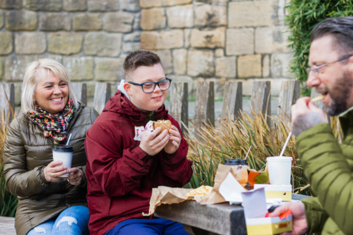
    

    

      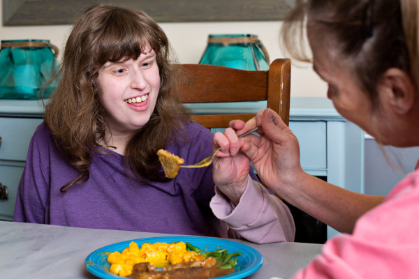
    

  

</section>

<section class="even">
  

    

      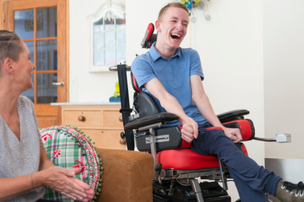
    

  

  

## Was machen wir?

Wir geben den Menschen eine Stimme, die sich aufgrund von schwerer und schwerster Behinderung selbst nicht artikulieren können. Wir werden unterstützend tätig, um das Leben der Bewohner der geplanten Wohneinrichtung in Soest zu verschönern. Diese Unterstützung umfasst nicht nur die Ausgestaltung des direkten Wohnumfeldes, sondern auch Freizeitaktivitäten, Hilfsmittel etc.

  

</section>

<section class="odd">
  

## Was treibt uns an?

Die Lebenssituation der Menschen mit Behinderung treibt uns an. Wir möchten, dass es ihnen gut geht und dass sie heimatnah ein schönes Leben haben. Die meisten der Betroffenen können nicht für sich selbst sorgen und ihre Bedürfnisse nicht eigenständig artikulieren. Sie werden ihr ganzes Leben lang auf Unterstützung
angewiesen sein. Wir als Angehörige möchten die Voraussetzungen für ein glückliches und erfülltes Leben schaffen.

  

  

    

      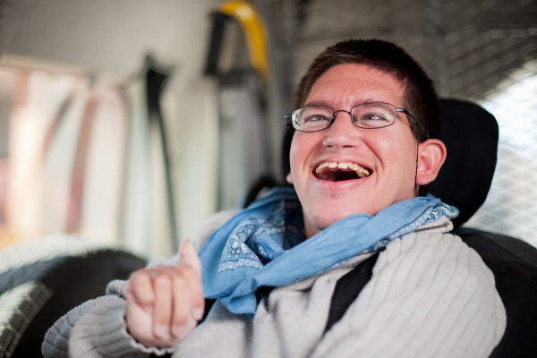
    

    

      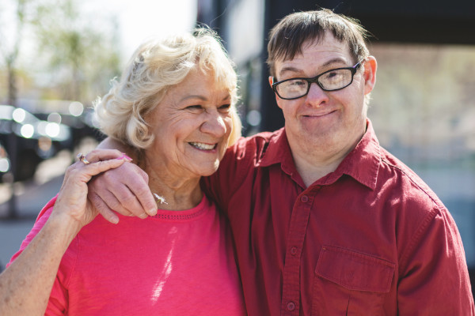
    

  

</section>

<section class="even">
  

    

      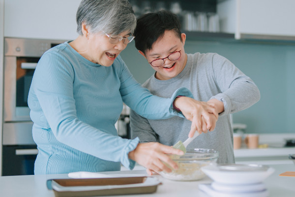
    

    

      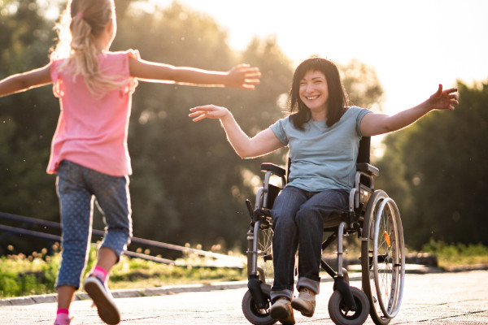
    

  

  

## Welche Ziele verfolgen wir?

Gemäß dem Leitbild „Besser wohnen und leben für Menschen mit Behinderung“ setzen wir uns dafür ein, dass unsere Angehörigen an Lebensqualität gewinnen. Wir möchten einen Beitrag zu einem Wohnumfeld schaffen, in dem sich die Bewohner zuhause fühlen können. Wir möchten ihnen durch Freizeitangebote die Teilhabe am gesellschaftlichen Miteinander innerhalb und außerhalb der Soester Stadtgrenzen ermöglichen und ihnen durch das Bereitstellen angemessener Transportmittel zu mehr Unabhängigkeit und Spontaneität verhelfen.

  

</section>

<section class="odd">
  

## Wollen Sie mitmachen?

Jeder kann mitmachen! Wir begrüßen Privatpersonen ebenso gerne wie Unternehmen, Vereine und Stiftungen.
Wenn Sie unsere Ziele unterstützen möchten, dann seien Sie herzlich willkommen! Wir freuen uns über Unterstützung jeder Art – sei es in Form einer passiven Mitgliedschaft oder als aktives Mitglied in unserem Förderverein.

  

  

    

      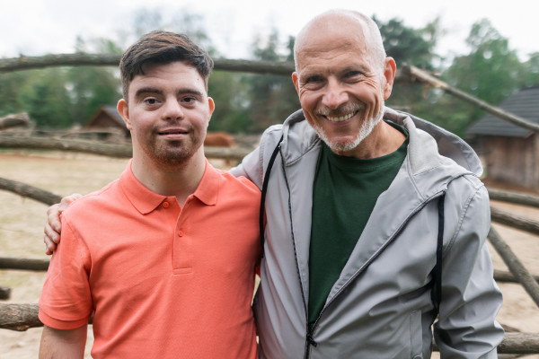
    

  

</section>

<section class="even">
  

## Hier finden Sie uns!

Bei Fragen wenden Sie sich gerne an uns.

LebensTraum-Soest e. V.  
In den Kalten Höfen 31  
59494 Soest  
Telefon 0 29 21 - 3 39 71 73  
www.lebenstraum-soest.de  
info@lebenstraum-soest.de

  

</section>

  

    

      <a class="button is-primary" href="#vorstand">Vorstand</a>
    

    

      <a class="button is-primary" href="">Satzung</a>
    

    

      <a class="button is-primary" href="Datenschutzerklärung.pdf">Datenschutz</a>
    

  

  

    

      <a class="button is-primary" href="#spendenkonto">Spendenkonto</a>
    

    

      <a class="button is-primary" href="Mitgliedsantrag.pdf">Mitgliedsantrag</a>
    

    

      <a class="button is-primary" href="#impressum">Impressum</a>
    

  

<section class="odd vorstand">
  

## Vorstand

  

  

    

      

        
        

          
Klaus Tappesser

          
1. Vorsitzende

        

      

      

        
        

          
Stefan Torley

          
2. Vorsitzende

        

      

    

    

      

        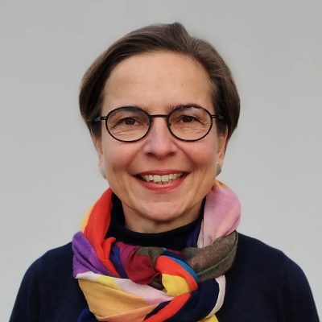
        

          
Katja Tappesser

          
Schriftführerin

        

      

      

        
        

          
Manuela Birkenhof

          
Kassenwartin

        

      

    

  

</section>

<section class="even">
  

## Spendenkonto

Sie möchten unseren Verein finanziell unterstützen?  
Wir freuen uns!

Volksbank Soest

**IBAN: DE46 4146 0116 3260 9260 9208 00**

**BIC GENODEM1SOE**

Bitte kontaktieren Sie uns, wenn Sie eine Spendenquittung benötigen.  
Vielen Dank

  

</section>

<section class="odd">
  

## Impressum

LebensTraum-Soest e. V.  
In den Kalten Höfen 31  
59494 Soest  
Telefon 0 29 21 - 3 39 71 73  
www.lebenstraum-soest.de
info@lebenstraum-soest.de

Vereinsregister  
Amtsgericht Arnsberg

  

</section>
